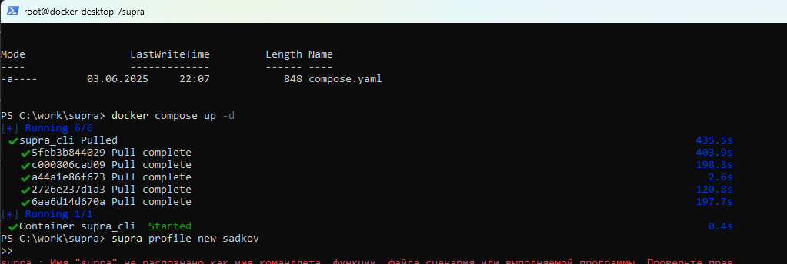
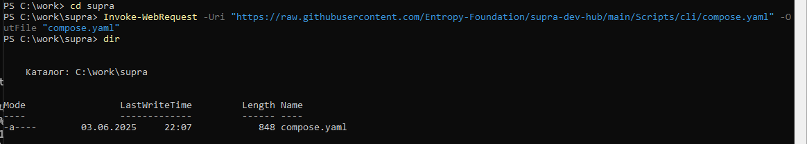
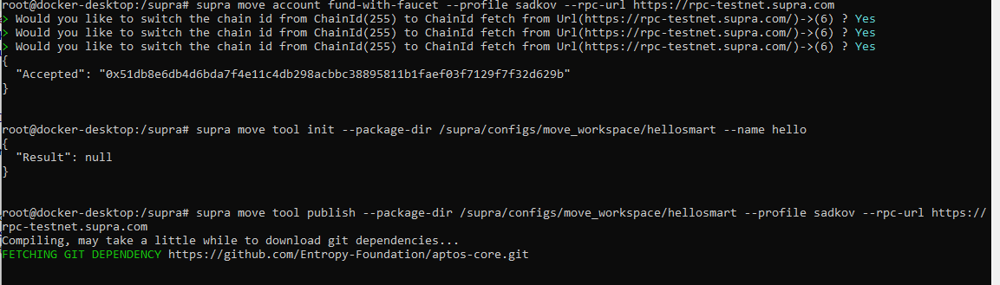
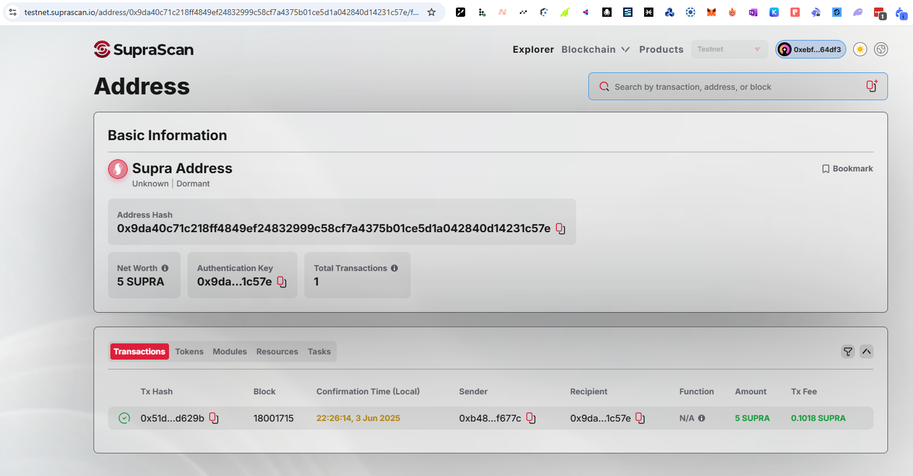
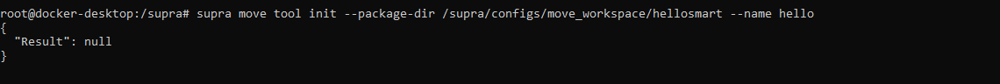

# supra_contract

# Supra Move CLI Guide for Testnet

### 1. Download compose.yaml (PowerShell on Windows)

```powershell
Invoke-WebRequest -Uri "https://raw.githubusercontent.com/Entropy-Foundation/supra-dev-hub/main/Scripts/cli/compose.yaml" -OutFile "compose.yaml"
```

### 2. Start Docker services (PowerShell on Windows)

```powershell
docker compose up -d
```





If you see `dockerDesktopLinuxEngine` error:
- Open **Docker Desktop**
- Ensure that **Linux containers** mode is enabled (not Windows containers)

### 3. Access Supra CLI container (via PowerShell or Docker Desktop GUI)

**Option 1: Terminal command**
```powershell
docker exec -it supra_cli /bin/bash
```

**Option 2: GUI**
- Open Docker Desktop
- Go to **Containers** → `supra_cli`
- Click **CLI** button (terminal icon)

---

### 🔁 How to restart Supra CLI after Docker shutdown

1. Make sure Docker Desktop is running again
2. Run:
```powershell
docker ps -a
```
Ensure `supra_cli` container is listed

3. Start the container if it's stopped:
```powershell
docker start supra_cli
```

4. Access it again:
```powershell
docker exec -it supra_cli /bin/bash
```

---

### 4. Create a profile

```bash
supra profile new sadkov
```

Tip: use a strong password.

### 5. Fund your account on Testnet

```bash
supra move account fund-with-faucet --profile sadkov --rpc-url https://rpc-testnet.supra.com
```



Here is how a successful balance top-up looks in the testnet:



### 6. Initialize a Move package

```bash
supra move tool init --package-dir /supra/configs/move_workspace/hellosmart --name hello
```



### 7. Manually check your Move.toml

```toml
[addresses]
hello_blockchain = "0x626bef95bca92ce26d8749aab7359949156a179c9fa4f8d41d517f7569acbec4"
```

### 8. Publish the module

```bash
supra move tool publish --package-dir /supra/configs/move_workspace/hellosmart --profile sadkov --rpc-url https://rpc-testnet.supra.com
```

### 9. View your module

```bash
supra move tool show --query module --name message --account-address 0x626bef95bca92ce26d8749aab7359949156a179c9fa4f8d41d517f7569acbec4 --rpc-url https://rpc-testnet.supra.com --chain-id 6
```

### 10. Write a message

```bash
supra move tool run   --function-id 0x626bef95bca92ce26d8749aab7359949156a179c9fa4f8d41d517f7569acbec4::message::set_message   --args string:"Hello from Supra!"   --profile sadkov   --rpc-url https://rpc-testnet.supra.com
```

### 11. Read the message

```bash
supra move tool view   --function-id 0x626bef95bca92ce26d8749aab7359949156a179c9fa4f8d41d517f7569acbec4::message::get_message   --args address:0x626bef95bca92ce26d8749aab7359949156a179c9fa4f8d41d517f7569acbec4   --rpc-url https://rpc-testnet.supra.com   --chain-id 6
```

### Example output:
```json
{
  "result": [
    "Hello from Supra!"
  ]
}
```

---

You can repeat `set_message` to update the message as needed.
